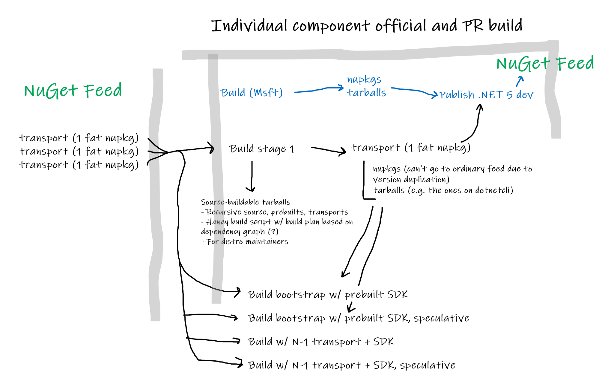

# Source-build's place in a build pipeline

For each repo, source-build must occur in the same official build pipeline that
produces the Microsoft product. This is needed to guarantee the version is the
same and source-built intermediates are available for uptake by downstream
repos.

## Official build

In official builds, it is important for source-build to be reliable, and not
extend the build time. This means only the necessary steps are performed to
produce the source-build intermediates: minimal or no validation.

The source-build job produces artifacts that are published by the Arcade stages,
like any other artifacts. This will be facilitated by yaml templates in Arcade,
but may require action for each repo to add.

## PR validation and rolling builds

There are a variety of extra ways to validate source-build. For example,
speculatively building ([speculative-build.md]) an SDK with the current PR's
changes, testing the bootstrap flow, etc.

Depending on the value each type of validation adds to a specific repo, these
should be configured. They may change depending on the risk of certain breaks
per repo, or the state of the release cycle. For example, a `master` branch is
likely to hit API breaks frequently and not work speculatively, but a servicing
branch may find value in confirming there are no such breaks.

For rolling builds and PR validation, there can be extra pipelines to run these
steps, to avoid interfering with dev workflows.

## Rough sketch of an onboarded pipeline

The following rough diagram shows a pipeline with official build and validation
jobs enabled:

> 

[speculative-build.md]: speculative-build.md
